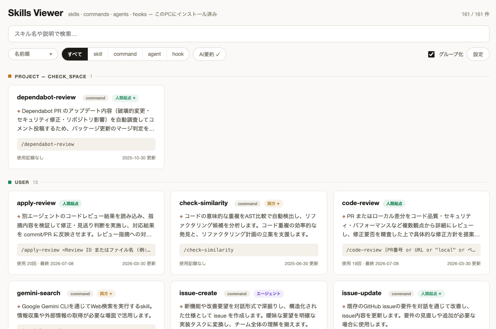

# skills-viewer

Read, search and diagnose your [Claude Code](https://code.claude.com) skills, commands, agents, hooks, auto memory and CLAUDE.md in the browser.

Scans every project registered in `~/.claude.json` (plus user scope, plugins and built-ins), and serves a local web UI to explore them — with usage stats, AI-generated summaries, full SKILL.md rendering and same-name diffs. It reads and explains; changes are handed to Claude Code (as a paste-ready instruction) or to your editor.

```bash
npx skills-viewer
```

> Zero runtime dependencies. The published package ships a prebuilt UI; `npx` installs in seconds.

<!-- 相対パス参照: private リポジトリでも GitHub 上で表示でき、npmjs.com は repository フィールドを元に raw URL へ書き換えるため public 化後は npm でも表示される -->



## Features

- **Home answers three questions** — what changed since you last looked, what this session actually loads, and what is available in it. The list is no longer the first thing you see
- **What's loaded, and what it costs** — the _session context_ block adds up everything Claude Code reads at the start of a session in the current project: the CLAUDE.md files, the `MEMORY.md` index (against the official 200-line / 25 KB limit) and every name + description (against the 1 % budget). System prompt, MCP tools and hook output are not visible to the viewer and are excluded
- **CLAUDE.md, all seven layers** — managed policy, `~/.claude/CLAUDE.md`, `CLAUDE.md`, `.claude/CLAUDE.md`, `CLAUDE.local.md`, `.claude/rules/*.md` and ancestor files up to the git root, listed in load order with per-heading token cost and `@import` expanded in place. Layers that do not exist stay on the list as _none_, because what is **not** read is information too
- **Two themes** — Console (dark, monospace labels, dense rows) and Ledger (light, rows and tables). Follows your OS setting by default and can be pinned in settings; the layout is fluid down to a 900 px minimum
- **All scopes in one view** — user (`~/.claude/skills`), every project's `.claude/skills` / `.claude/commands`, installed plugins, and Claude Code built-ins. The current project opens first and the rest stay collapsed, so "what is in this repo" is not buried in what applies everywhere
- **Purpose grouping (AI)** — one haiku call classifies everything installed by _when you use it_ into 4–8 groups generated for your environment (planning / building / review / release / … as a role-agnostic guide — a designer's or PM's skills get their own groups). Pick between by-source, by-purpose and single-list orderings in the _all projects_ view; a frontmatter `category:` pins an item to a manual group that takes precedence
- **Search / sort** — incremental search over name + description + usage; sort by name, usage count, last used, updated date, or token cost
- **Diagnostics** — a _no recent use_ badge (no recorded use within the transcript retention window) with an all / recent use / no recent use filter, plus static description lint: missing / too-short / too-long descriptions, missing trigger conditions ("use when …") that make auto-invocation unlikely, and name-echo descriptions
- **Token cost** — since every name + description is injected into each session, the estimated token overhead is shown per item, per scope, and as a per-session total for the current project
- **AI trigger diagnosis** — one click asks the model whether the description is likely to trigger auto-invocation, lists concrete issues, and proposes an improved description (cached by content hash). The result comes with a paste-ready instruction for Claude Code — the target path, what to change (or what to keep if you change it), and the "check first, ask when unsure, execute after approval" steps — so the edit happens where you can review it
- **AI flow diagram** — extract the processing flow of orchestration-style skills (steps, branches, delegations, human gates) from the definition body and render it as a step diagram; delegated skills are clickable
- **AI model choice** — pick the model behind all AI features (haiku default / sonnet / opus) in settings; aliases are resolved by your claude CLI
- **Memory triage** — a _Memory_ view lists Claude Code's auto memory (`~/.claude/projects/<project>/memory/`, or the directory set by `autoMemoryDirectory`) per project with its context cost split into the always-on part (the `MEMORY.md` index line injected into every session) and the pay-per-use part (the body, read on demand), plus Read / Write counts from transcripts, `[[link]]` resolution and backlinks. **AI triage** reads every memory of a project with the claude CLI (one call, split into a few for very large projects) and proposes a destination per memory — keep / shrink / move to CLAUDE.md / move to your user CLAUDE.md / move to docs / move to a skill / delete / wrong project — with the reasoning and a paste-ready instruction for Claude Code (it is asked to always cover removing the `MEMORY.md` index line and re-pointing `[[link]]`s). Each memory is first judged for freshness (current / outdated / historical / obsolete) from mechanical signals — dates in the body, missing paths, merged or deleted branches, references to another project — and a _rewrite the body_ verdict covers memories whose gist still holds; the triage also flags when the `MEMORY.md` index line disagrees with the body. For feedback memories the instruction is built from a fixed template, so it reads the same on every model. The viewer never writes to memory: you paste the instruction into Claude Code, which inspects, asks when unsure, and executes after your approval
- **What's changed** — the first block on the home screen lists what was added / updated / removed since you last marked it read, in GitHub's diff grammar (`+` / `~` / `−`). Skills, commands, agents, **auto memory and CLAUDE.md** are all tracked, and for files under git the author and date come from `git log` (looked up for the first 40 changed files, within a short time budget; the rest show the date only); the CLI prints a one-line summary at startup too
- **Usage sparkline** — the detail pane charts the last 30 days of per-day usage
- **Usage stats** — invocation counts and last-used dates aggregated from Claude Code session transcripts (`~/.claude/projects/`), covering both user-typed `/skill` calls and model-invoked Skill tool calls
- **AI summaries** — one-click summarization of each SKILL.md via `claude -p --model haiku`, cached by content hash in `~/.cache/skills-viewer/` so unchanged skills are never re-summarized
- **One page per item** — a single column, read top to bottom: summary, then a strip of facts (usage, when it was added and by whom, same-name definitions, bundled files), then how it triggers, what it touches (delegates and `allowed-tools`, so writes and outbound calls are known without asking the model), then the flow, then the full text. Hooks get a short page of their own (event, matcher, command, and the other hooks in the session)
- **Agents & hooks too** — `.claude/agents/*.md` and `hooks` entries from `settings.json` / `settings.local.json` are listed alongside skills with kind badges (a hook is a `settings.json` entry, not a file of its own)
- **Read-only by design** — the viewer never edits, copies or deletes your definitions. It diagnoses and explains, then hands the change over: a paste-ready instruction for Claude Code, or _Open in editor_ for any file it is allowed to read
- **Same-name diff** — when the same skill name exists in multiple scopes, the detail page lists the other definitions and shows a line diff between them
- **Open in editor** — via URL scheme (VS Code / Cursor / Zed / Windsurf / custom, configurable in the ⚙ settings modal), or the OS default opener; offered for every file inside the paths the viewer may read, including `settings.json` and not only `.md`
- **English / 日本語** — UI language auto-detected from the browser and switchable in settings; AI summaries are generated in the selected language (CLI messages follow `LANG`)
- **URL routing** — `/skills/:id`, `/claude-md/:id`, `/memory`, `/memory/:id`, with `?project=<id>|all`, search, sort and filters in query params; the project id is derived from its path, so links are shareable across reloads

## Usage

```bash
npx skills-viewer              # scan + open browser (default port 4763)
npx skills-viewer --port 5000  # custom port
npx skills-viewer --no-open    # don't open the browser
```

Run it from a project directory to have that project marked as “current” and listed first. Reloading the page rescans the filesystem.

## Security

- Binds to `127.0.0.1` only
- Mutating APIs require a per-run token that other origins cannot read (same-origin policy), and requests with a non-localhost `Origin` are rejected
- **The viewer never modifies your definitions.** It writes only its own state (the "what's changed" baseline and the AI result cache under `~/.cache/skills-viewer/`); the other mutating APIs just start a `claude` CLI call or hand a path to your editor
- Reads stay inside `~/.claude`, the per-project `.claude` directories, the `autoMemoryDirectory` you configured, and **the CLAUDE.md files Claude Code itself loads for the current project** — `CLAUDE.md`, `CLAUDE.local.md`, `.claude/rules/*.md` and ancestor `CLAUDE.md` files up to the git root. That last group sits outside `.claude`, so it is allowed by exact path: only the files the scanner enumerated at those fixed names and places, never an arbitrary `.md`. A symlinked `CLAUDE.md` is followed, since Claude Code follows it too (`ln -s AGENTS.md CLAUDE.md` is a documented setup). An `autoMemoryDirectory` that resolves to a filesystem root, your home directory or an ancestor of it is ignored. _Open in editor_ is limited to the same paths
- `@import` inside a CLAUDE.md is followed only within the project or `~/.claude`, up to 4 levels (the official limit) and 4 MiB per file (the size at which Claude Code itself skips a file). A CLAUDE.md arrives with a cloned repository, so `@/etc/hosts` is reported as out of scope and never opened — not even to check whether it exists. Dot-prefixed names and anything under `.git` stay out of reach even inside the project (`.claude` itself is the exception, since it is the boundary), and the boundary is re-checked after symlinks resolve. At most 200 references per file and 500 per scan are followed; when either limit is reached, the home and CLAUDE.md screens say so, since the token totals they show are then short of the rest. A file larger than 4 MiB is listed but shown as not loaded, since Claude Code skips it too
- Only the bodies under `~/.claude`, the per-project `.claude` directories and the `autoMemoryDirectory` are ever sent to the `claude` CLI. The CLAUDE.md group sits outside those, so it is displayed but never sent — `CLAUDE.local.md` in particular is usually gitignored and private
- On startup the viewer deletes `~/.cache/skills-viewer/backups/`, the one-generation copies the v0.8 in-browser editor used to make. Nothing writes there any more, and it prints a line when it removes them
- Reading the previous version of a file (for the diff) runs local `git show` inside the same allowed paths, and `git log` supplies the author for changed files. Both are invoked as argument arrays with a timeout, never through a shell, and no network access is involved

## Development

```bash
pnpm install
pnpm dev        # tsx watch API server (4763) + Vite dev server (5173, /api proxied)
pnpm build      # web UI → dist/, server TS → build/
pnpm typecheck  # web + server
pnpm start      # serve dist/ + API (what npx users get)
```

Layout:

```
src/
├─ cli.ts         # bin entry
├─ server/        # zero-dep Node API (scan / usage / summary / read-access) — TypeScript
└─ shared/        # types shared between server and web (single source)
web/              # React + TypeScript + Vite (devDependencies only — bundled into dist/)
build/            # compiled server JS shipped in the npm package (generated by prepack)
dist/             # prebuilt UI shipped in the npm package (generated by prepack)
```

## Notes

- Usage stats only cover the transcript retention window of Claude Code (`cleanupPeriodDays`, default 30 days) — the _no recent use_ badge and memory Read counts have the same limitation (projects without transcripts show no usage columns at all)
- Token costs are heuristic estimates (≈4 chars/token for ASCII, ≈1.5 for CJK), not exact tokenizer counts
- Usage is attributed per calling project (worktrees roll up to their parent project by encoded-path prefix). When scopes share a name, the resolution order project > user > plugin > built-in is assumed
- The built-in skill list is hardcoded in `server/scan.js` (they live inside the Claude Code binary); check `/skills` inside Claude Code for the authoritative list
- AI features require a logged-in `claude` CLI. Its presence is checked once at startup (`claude --version`); if it is missing, the AI buttons are disabled with a note — install it and restart the viewer to enable them
- Memory triage sends each memory's body to the claude CLI, together with the project's `MEMORY.md` index, the **headings** of `CLAUDE.md` / `.claude/CLAUDE.md` / `~/.claude/CLAUDE.md` and the names + descriptions of the skills available to that project (never their bodies) so it can spot duplicates and promotion targets. Branch status for the freshness signals comes from local `git` (no network). Results are cached per memory by content hash (plus the index line); memory files themselves are never modified
- The Memory view resolves `autoMemoryDirectory` from your user settings and the current project only — project-scope settings of other projects are not read

## License

MIT

---

This is an unofficial community tool, not affiliated with Anthropic.
